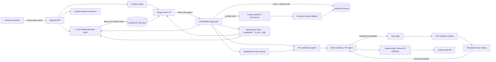

# Technical PRD: Triage Control

**Project:** Compounding Telemetry Triage Agent
**Event:** Data & AI Hackathon: From Memory to Muscle Memory
**Owner:** Person 2 — Orchestrate, Act, Verify
**Build window:** 8 hours
**Status:** Hackathon implementation spec

## 1. Product summary

Triage Control is a custom observability platform that turns a selected browser failure into an automatically opened, evidence-rich draft pull request. It combines a privacy-preserving user-session trace with durable incident memory. From Telemetry Logs, the operator clicks **Patch with agents**, which starts a portable RocketRide `.pipe` pipeline and opens a run-scoped React 3D agent decision graph. Five fix agents work in parallel on the left; a sixth synthesis/PR agent continuously weighs their proposals at a central node slightly to the right. Only a Snyk-clean candidate that passes exact-session replay in the single sandbox may be committed and published as a draft PR.

The product's differentiator is compounding behavior: the first incident is reasoned through end to end; a structurally similar incident reuses a Modiqo/Rote Play and completes substantially faster. A reused patch is still rescanned and replay-verified before it can be shown.

## 2. Goals and non-goals

### Goals

- Show a live incident from capture through verified resolution in one UI.
- Use a RocketRide `.pipe` pipeline and a root RocketRide Wave node to invoke bounded specialist agents through RocketRide's documented parent-agent/subagent tool pattern.
- Spawn five independent fix agents concurrently, stream visibility into each one, and select a winning candidate through one serialized security/verification queue.
- Make patching an explicit, idempotent action from a selected terminal event in Telemetry Logs, then navigate directly into that incident's agent workflow.
- Render the run as a React 3D force graph with selectable fix-agent nodes, an always-visible A6 decision loop, and auditable proposal weights.
- Automatically create a GitHub draft pull request containing the exact verified patch and its evidence.
- Replay the exact privacy-safe action sequence with Playwright.
- Use Cognee to extract a typed incident graph, export a canonical verified record through an application adapter, persist and recall it through HydraDB, and crystallize the successful method with Modiqo/Rote.
- Prove compounding with a live hotdata.dev query comparing first-run and replay-run time to fix.

### Non-goals

- Arbitrary third-party applications or unbounded autonomous patching.
- More than one verification sandbox.
- Automatic PR merge, production deployment, or direct writes to the protected base branch. Automatic draft-PR creation is explicitly in scope.
- A general-purpose issue-memory ontology.
- A full analytics product; only one telemetry table and 2–3 demo queries are required.
- Capturing raw keystroke content.

## 3. Users and primary workflow

The primary user is an engineer or hackathon judge watching an incident resolve. The operator selects a terminal event in Telemetry Logs, starts patching, watches five fix agents work concurrently through RocketRide FLOW/SSE events in a run-scoped decision graph, inspects A6's live ranking rationale, and receives an automatically created draft PR only after security and sandbox gates pass.

1. A console error or failed request closes the capture window and creates an `incident_ready` record; capture and Cognee phase A continue, but no code-changing workflow starts automatically.
2. In Telemetry Logs, the operator selects that terminal event and clicks **Patch with agents**. The client sends one idempotent patch command, receives the RocketRide run key, and navigates to `/incidents/{incidentId}/agents?run={rocketrideRunKey}`.
3. RocketRide starts `triage.pipe` with the incident, action-sequence fingerprint, code snapshot, and affected-component hint. Graph context is retrieved inside the pipeline, not trusted as caller input.
4. RocketRide obtains exact-first/hybrid HydraDB memory and code context, then spawns five fix agents concurrently. One worker follows the memory/Rote path while four explore independent minimal, boundary, test-first, and type-hardening approaches.
5. The UI renders A1–A5 as selectable nodes on the left of a React 3D force graph, all linked to A6 slightly right of center. Selecting A1–A5 updates the left inspector; A6's decision loop and proposal weights remain pinned in the right inspector.
6. A6 receives candidates and evidence as they arrive, emits a new ranking revision, and proposes the next eligible candidate for the deterministic Snyk/sandbox queue. The first candidate satisfying all gates wins; remaining work is cancelled or retained only as diagnostic evidence.
7. The winning patch is rechecked against the original base SHA, committed to an incident branch, and automatically opened as a GitHub draft PR with Snyk and replay evidence. Agents never auto-merge.
8. Cognee enriches the resolved incident, an explicit export adapter writes the verified canonical record and PR identity to HydraDB, and the successful method is crystallized or refreshed as a Modiqo/Rote Play.
9. The UI surfaces the live graph, bounded decision rationale, verified diff, and draft-PR URL; hotdata.dev shows run-over-run timing, per-agent activity, and ranking revisions.

## 4. Required sponsor integrations

**Mandatory-runtime rule:** there is no development or production feature flag that disables, mocks, or substitutes any sponsor integration. Every patch request must call RocketRide, HydraDB, Modiqo/Rote, Snyk, Cognee, and hotdata.dev on the critical path and persist their real receipts. Missing credentials, unavailable services, or invalid responses transition the run to `needs_human`; they can never produce a synthetic success or draft-PR claim. Deterministic stand-ins are restricted to the automated test process (`NODE_ENV=test`) and are unreachable from a normal application server.

Every sponsor below is on the critical demo path. A logo, health badge, mocked response, or unused SDK does not satisfy the requirement.

| Sponsor | Where it belongs | How it is used | Required demo evidence |
|---|---|---|---|
| **RocketRide.ai** | Parallel-agent orchestration and live observability | The runtime loads `triage.pipe`; a root Wave invokes five fix agents concurrently through `run_agent`, then a sixth synthesis/PR agent. A WebSocket monitor subscribes to `TASK`, `SUMMARY`, `FLOW`, and `SSE`; the run starts with `pipelineTraceLevel:"summary"`. A6 emits bounded decision revisions and next-proposal events. Deterministic Snyk, sandbox, and GitHub publisher tools remain gates. | Committed `.pipe`, VS Code canvas, run token/key, six named graph nodes, FLOW enter/leave traces, SSE progress/weight/proposal messages, candidate IDs/durations, and Cloud/local-engine status |
| **Cognee.ai** | Two-phase semantic structuring | Phase A remembers observed `Incident`, `Error`, `UIComponent`, and `UserActionShape`. Phase B, after verification and draft-PR creation, adds `RootCause`, `Fix`, `Play`, `PullRequest`, and verified provenance using a narrow custom `graph_model`. | Cognee dataset/run receipt and extracted entity/relationship payload; hypotheses are visibly distinct from verified facts |
| **HydraDB** | Durable resolved-incident memory | An application-owned adapter exports Cognee's verified canonical record to managed HydraDB. The pipeline performs exact-first then hybrid recall, and each strategy receives only application-validated context. | Ingestion source ID, completed processing receipt, recall request/result, prior incident/source ID, graph context, and latency |
| **Modiqo.ai (Rote)** | Reusable operational method | Rote records a successful run in a workspace, crystallizes it into an inspectable Play, and Run 2 executes a pinned Play URI with fresh inputs/current tools. | `rote play inspect` contract, owner/version/declared effects, Run 1 crystallization evidence, Run 2 JSON step report and pinned URI |
| **Snyk** | Mandatory pre-execution security boundary | Run Snyk Code on every fresh or replay-produced candidate; run Open Source scanning when dependency files change. Non-clean, scanner errors, auth failures, and timeouts fail closed. | CLI version, command, exit code, issue counts/IDs, artifact hash, and the same patch hash used by replay evidence |
| **hotdata.dev** | Shared analytical telemetry layer | The backend spools capture, normalized RocketRide agent activity, gates, and PR-publication events locally; publishes typed CSV microbatches atomically to one Hotdata table; and runs live HotSQL queries for timing proof. UI live updates use RocketRide/SSE, not fictitious row-at-a-time SQL inserts. | Database/load receipt and trace ID plus live CLI/API timing and per-agent queries against the real `triage_events` table |

### 4.1 Official source and setup register

| Sponsor | Product and documentation | Hackathon/setup material |
|---|---|---|
| RocketRide.ai | [rocketride.org](https://rocketride.org/), [documentation](https://docs.rocketride.org/), [runtime](https://docs.rocketride.org/concepts/runtime-engine/), [RocketRide Wave](https://docs.rocketride.org/nodes/agent_rocketride/), [WebSocket protocol](https://docs.rocketride.org/protocols/websocket), [observability protocol](https://docs.rocketride.org/protocols/websocket/observability/), [TypeScript SDK](https://docs.rocketride.org/develop/typescript/), [Python SDK](https://docs.rocketride.org/develop/python), [pipelines](https://docs.rocketride.org/concepts/pipelines), [VS Code extension](https://docs.rocketride.org/ide-extensions/vscode/usage/), [GitHub](https://github.com/rocketride-org), [Cloud](https://cloud.rocketride.ai) | Event listing: [RocketRide hackathon page](https://hackathon.rocketride.org/). The requested Google Doc and YouTube walkthrough could not be verified from public official sources; paste the organizer-provided URLs here before submission. Do not invent them. |
| HydraDB | [hydradb.com](https://hydradb.com/), [quickstart](https://docs.hydradb.com/quickstart), [API reference](https://docs.hydradb.com/api-reference), [cookbook](https://docs.hydradb.com/cookbooks/hydradb-cookbook-06), [open-source repository](https://github.com/hydra-db/hydradb) | Use managed HydraDB for the 8-hour build. The OSS OpenCypher/Bolt deployment is an alternative, not a second simultaneous integration. |
| hotdata.dev | [hotdata.dev](https://hotdata.dev/), [quick start](https://www.hotdata.dev/docs/quick-start), [push data and limits](https://www.hotdata.dev/docs/push-data), [API reference](https://www.hotdata.dev/docs/api-reference), [GitHub organization](https://github.com/hotdata-dev) | Complete CLI authentication and create the demo database/table before the sprint's integration phase. |
| Cognee.ai | [cognee.ai](https://www.cognee.ai/), [documentation](https://docs.cognee.ai/), [introduction](https://docs.cognee.ai/getting-started/introduction), [quickstart](https://docs.cognee.ai/getting-started/quickstart), [`remember` API](https://docs.cognee.ai/python-api/remember), [custom model example](https://github.com/topoteretes/cognee/blob/main/examples/guides/custom_data_models.py) | Cognee's documented graph-store adapters do not include HydraDB; the project therefore owns the explicit export adapter. See [supported graph stores](https://docs.cognee.ai/setup-configuration/graph-stores). |
| Modiqo.ai (Rote) | [modiqo.ai](https://www.modiqo.ai/), [documentation](https://www.modiqo.ai/docs), [how Rote works](https://www.modiqo.ai/blog/what-rote-is), [FAQ](https://www.modiqo.ai/faq), [run a Play](https://www.modiqo.ai/docs/run-your-first-play), [work with Plays](https://www.modiqo.ai/docs/work-with-plays) | [Rote Playoffs warm-up guide](https://www.modiqo.ai/blog/the-playoffs/enter-the-arena) |
| Snyk | [snyk.io](https://snyk.io/), [documentation](https://docs.snyk.io/), [getting started](https://docs.snyk.io/getting-started-guides/getting-started), [CLI install](https://docs.snyk.io/developer-tools/snyk-cli/install-or-update-the-snyk-cli/installing-snyk-cli-as-a-binary-using-npm), [CLI authentication](https://docs.snyk.io/developer-tools/snyk-cli/authenticate-to-use-the-cli), [`snyk code test`](https://docs.snyk.io/developer-tools/snyk-cli/commands/code-test), [`snyk test`](https://docs.snyk.io/developer-tools/snyk-cli/commands/test) | **TBD — organizer-provided hackathon free-signup URL.** No official public event-specific signup URL was verifiable; use the link from the event document. |

### 4.2 Sponsor failure policy

| Sponsor failure | Required behavior |
|---|---|
| RocketRide Cloud unavailable | Run the same `.pipe` on the local open-source engine; if the Wave node is unstable, use the deterministic RocketRide branch and mark degraded |
| RocketRide monitor disconnects | Reconnect and resubscribe because subscriptions are not durable; use the seeded TASK/SUMMARY snapshot to recover current state and visibly mark any FLOW/SSE history gap |
| Cognee extraction unavailable/invalid | Queue the validated privacy-safe record, continue fresh diagnosis with raw structured context, and do not claim semantic memory was written |
| HydraDB unavailable/not indexed/no match | Retry bounded transient failures; otherwise record memory miss and continue fresh diagnosis |
| Rote Play invalid/stale/fails | Preserve evidence, resume once if supported, then fall back to fresh diagnosis |
| Snyk finding/scanner failure/auth failure | Fail closed to `needs_human`; do not execute or surface the candidate |
| hotdata.dev unavailable/load conflict/rate limit | Retain the local outbox and retry idempotently; show analytics degraded without changing verification truth |

## 5. System architecture



### Trust boundaries

- Browser events are untrusted input and are schema-validated at ingestion.
- The generated diff is data, never a shell string. Only allowlisted repository-relative paths may be changed.
- The sandbox has a CPU/time limit, an ephemeral filesystem, no cloud credentials, and denied egress except package-cache access if required.
- No patch is surfaced unless Snyk and replay verification both pass.
- The PR publisher receives only the exact verified patch hash and base SHA. It may create an incident branch and draft PR, but it has no permission or code path to merge or write to the protected base branch.
- Rote Plays are inspected and pinned to an immutable version for the demo; credentials remain in the runner and never enter the Play, HydraDB, Cognee, or hotdata.dev.
- Retrieved HydraDB text is context, never executable code. Application code must validate schema, patch applicability, Play version, and verified/Snyk-clean provenance.

## 6. RocketRide multi-agent pipeline

`.pipe` and Wave are not synonyms. A `.pipe` is portable pipeline JSON executed by the RocketRide runtime. `agent_rocketride` (RocketRide Wave) is an experimental node that plans parallel tool-call waves, requires one LLM and one memory connection, and exposes `run_agent` so a parent can invoke child agents. The demo uses a root Wave coordinator to spawn six bounded agents. Five independently attempt the same incident end to end from different strategies; the sixth synthesizes the race and publishes the verified winner. Snyk, sandbox replay, Git operations, and GitHub PR creation are deterministic tools, not agent assertions.

The ingestion service starts a run with the RocketRide TypeScript SDK: connect to the local engine or `cloud.rocketride.ai`, load `./triage.pipe`, execute with `pipelineTraceLevel:"summary"`, send the JSON incident input, retain the returned task token, and subscribe to runtime events for the live UI and telemetry spool. The VS Code extension is used to edit, validate, run, and inspect the pipeline. Use `full` traces only during debugging because they include every lane write and invoke call.

### Pipeline inputs

```ts
type TriageInput = {
  incidentId: string;
  sessionId: string;
  siteKey: string;
  terminalEvent: ConsoleErrorEvent | NetworkFailureEvent;
  actionTrace: PrivacySafeAction[];
  actionShapeHash: string;
  repositorySnapshot: string;
  repository: { owner: string; name: string; baseBranch: string; baseSha: string };
  affectedFilesHint?: string[];
};
```

### Agent contracts

| Spawned agent | Independent fix strategy | Required output | Limit |
|---|---|---|---|
| A1 Minimal Patch | Smallest localized change with minimal blast radius | Root cause, unified diff, regression assertions, risks | 12 s |
| A2 Boundary Normalization | Repair malformed/optional data at the earliest owned boundary | Same `PatchCandidate` contract | 12 s |
| A3 Memory-Guided | Adapt HydraDB context and a pinned Rote Play to current inputs/tools | Same contract plus memory/Play provenance | 8 s |
| A4 Test-First | Encode the captured failure as a regression assertion, then patch | Same contract plus strongest assertion set | 15 s |
| A5 Type Hardening | Eliminate the invalid state through types/schema validation | Same contract plus typecheck impact | 15 s |
| A6 Synthesis + PR | Consume candidates as they arrive, reject invalid contracts, rank, feed the serial gate, and publish the winner | Selection evidence and draft-PR receipt | 30 s overall |

```ts
type PatchCandidate = {
  candidateId: string;
  agentId: "A1" | "A2" | "A3" | "A4" | "A5";
  baseSha: string;
  rootCause: { category: string; summary: string };
  unifiedDiff: string;
  patchHash: string;
  affectedPaths: string[];
  assertions: Array<{ id: string; description: string }>;
  risks: string[];
  confidence: number;
  memory?: { hydraSourceId?: string; playUri?: string };
};
```

All five workers receive the same immutable incident/code snapshot and may not push branches, create PRs, or edit the shared workspace. Their only write is a structured candidate result. A6 cannot declare a candidate safe; it must call the deterministic Snyk and sandbox tools. Eligibility and the documented proposal-weight calculation determine queue priority; exact score ties break by fewer changed lines, earlier arrival, then lexical candidate ID. The single sandbox processes one candidate at a time; the first full pass wins and causes outstanding workers to be cancelled or marked superseded.

### Per-agent RocketRide observability

RocketRide has no separate REST history endpoint for this trace. The observability ingester opens an authenticated RocketRide WebSocket and sends a DAP-style `rrext_monitor` subscription for `TASK`, `SUMMARY`, `FLOW`, and `SSE`, normally scoped with `token:"*"` for every task owned by the ingestion API token. Subscriptions are per connection and not durable, so every reconnect must resubscribe.

- `FLOW`/`apaevt_flow`: component `begin`/`enter`/`leave`/`end`, pipe/component identity, lane data/result/error, and stack. Store the free-form trace as JSON. FLOW is silent unless execution sets `pipelineTraceLevel`; `summary` is the production default and `full` is the debugging mode.
- `SSE`/`apaevt_sse`: each agent emits `monitorSSE(pipe_id, type, data)` at start, current action, candidate produced, blocked, superseded, failure, and completion. A6 additionally emits bounded weight-revision, reason-code, next-proposal, and gate-result events. This is the human-readable “what is this agent doing?” feed.
- `SUMMARY`/`apaevt_status_update`: aggregate lifecycle, progress, recent errors/warnings, CPU/memory/GPU metrics, and billing tokens.
- `TASK`/`apaevt_task`: begin/running/end/restart lifecycle used to recover active work after reconnect.

RocketRide does not provide a single global run ID. Compute `rocketrideRunKey = sha256(project_id + "|" + source + "|" + startTime)`. Order events within a WebSocket connection by DAP `seq`, and add a locally generated `connectionEpoch` because sequence numbers restart after reconnect. Map RocketRide component/pipe IDs to the stable agent IDs A1–A6 from the committed `.pipe` manifest.

Agent SSE payloads contain bounded status, never hidden chain-of-thought:

```ts
type AgentStatusEvent = {
  rocketrideRunKey: string;
  agentId: "A1" | "A2" | "A3" | "A4" | "A5" | "A6";
  candidateId?: string;
  phase: "started" | "reading" | "reasoning" | "tool_call" | "candidate_ready" |
         "weighting" | "proposing" | "gating" | "pr_publishing" | "pr_created" |
         "superseded" | "failed" | "completed";
  message: string;       // short action summary, no private reasoning
  progress?: number;
  patchHash?: string;
  timestamp: string;
};
```

### A6 decision loop and proposal weights

A6 is the continuously evaluating center of the run graph. “Continuous” is event-driven: every candidate, candidate revision, deterministic validation result, and gate result increments a monotonically increasing `decisionRevision`; there is no busy polling. The right inspector shows this bounded loop:

1. **Ingest** the newest structured candidate/evidence event.
2. **Score** the five eligible proposals with deterministic feature extractors.
3. **Challenge** conflicts such as weak assertions, excess blast radius, or stale memory provenance.
4. **Propose** the highest-scoring not-yet-gated candidate as the next fix attempt.
5. **Observe** Snyk/replay outcome, reject or select, then recompute if work remains.

```ts
type ProposalWeight = {
  rocketrideRunKey: string;
  decisionRevision: number;
  agentId: "A1" | "A2" | "A3" | "A4" | "A5";
  candidateId: string;
  eligible: boolean;
  score0to100: number;
  factors: {
    applicability: number;       // 0..1; parsed diff + matching base SHA
    assertionCoverage: number;   // 0..1; captured failure covered
    evidenceProvenance: number;  // 0..1; trace/Hydra/Rote receipts
    minimality: number;          // 0..1; inverse normalized blast radius
    riskControl: number;         // 0..1; allowlisted paths and change class
    confidenceCalibration: number; // 0..1; capped agent confidence signal
  };
  reasonCodes: string[];
  proposedNext: boolean;
  timestamp: string;
};
```

For eligible candidates, the application computes `score0to100 = 20×applicability + 20×assertionCoverage + 20×evidenceProvenance + 15×minimality + 15×riskControl + 10×confidenceCalibration`. Invalid contracts, non-applicable base SHAs, or forbidden paths are ineligible with score `0`. A6 may summarize comparison reasons, but it cannot alter these factor weights at runtime. The score prioritizes which candidate is tried next; it is not a probability of correctness and never replaces Snyk or replay.

The right panel renders one 0–100 horizontal bar per A1–A5, highlights `proposedNext`, and lists the factor deltas/reason codes behind the latest revision. It displays an auditable decision record—not hidden chain-of-thought, raw prompts, or private scratch work. The selected worker's FLOW/SSE activity remains in the left panel; selecting A6 never replaces the pinned decision-loop panel.

The ingester writes raw FLOW JSON and normalized SSE status into the local outbox, pushes SSE/WebSocket updates to the dashboard, and microbatches them to the same hotdata.dev table. Because SUMMARY retains only recent history and offline consumers miss FLOW/SSE windows, persistence must happen as events arrive. Test the SDK's high-level subscription surface against the installed version; if it does not expose FLOW/SSE, use the documented raw WebSocket `rrext_monitor` protocol.

### HydraDB memory-match contract

Managed HydraDB is called at `https://api.hydradb.com` with Bearer authentication and tenant `triage-control`. The gather-context wave first calls `/recall/boolean_recall` for exact error/action signatures, then `/recall/full_recall` with `graph_context:true`, a maximum of five results, sub-tenant `resolved-incidents`, and filters requiring `verified`, `snyk_clean`, and schema version `1`.

The application—not an assumed universal score threshold—decides compatibility by validating schema version, fix shape, affected-path applicability, pinned Play availability, and verified/Snyk-clean provenance. A rank or retrieval score may be displayed, but is not trusted as a normalized probability.

```ts
type MemoryMatch = {
  mode: "exact" | "hybrid" | "miss";
  priorIncidentId?: string;
  hydraSourceId?: string;
  hydraRank?: number;
  retrievalScore?: number;
  compatible: boolean;
  rejectionReasons: string[];
  playUri?: string;
  fixShape?: string;
  latencyMs: number;
};
```

### Modiqo/Rote Play contract

Store a pinned URI such as `https://play.modiqo.ai/team/triage-remediation@1.0.0`, not a loose Play ID. Before demo execution, run `rote play inspect <URI>` and verify required inputs, tools, credentials, writes, owner, and version. Run 2 uses `rote play run <URI> incident_json=<path> repo_path=<path> --output=json` through a RocketRide tool wrapper.

A Play preserves the successful method and executes it with fresh inputs and current tools; it does not return Run 1's old patch. If a Play has invalid inputs, stale tool/API fingerprints, or a failed step, preserve the step evidence, resume once when supported, then fall back to fresh diagnosis. It must never surface stale output or bypass Snyk/replay.

### Wave and branch semantics

```text
wave gather_context:
  hydra_exact_then_hybrid_recall + code_context + telemetry_snapshot (parallel tools)

wave candidate_race:
  A1.run_agent(minimal_patch, context)
  A2.run_agent(boundary_normalization, context)
  A3.run_agent(memory_and_rote_adaptation, context)
  A4.run_agent(test_first, context)
  A5.run_agent(type_hardening, context)

A6.run_agent(stream_candidates):
  on candidate_or_gate_event:
    revision = recompute_proposal_weights(A1..A5)
    emit agent_weight_updated(revision)

  while !winner && exists_eligible_ungated_candidate:
    candidate = highest_scoring_eligible_not_yet_gated(revision)
    emit candidate_proposed(candidate, revision)
    validate_contract_and_base_sha(candidate)
    security = snyk.scan(candidate)                    # serialized
    if !security.clean: reject candidate; recompute revision; continue
    verification = sandbox.apply_and_replay(candidate) # one sandbox
    if !verification.passed: reject candidate; recompute revision; continue
    winner = candidate
    cancel_or_supersede_remaining_workers()
    break

if winner && hashes_match(winner, security, verification):
  pr = github.create_draft_pr(exact_verified_winner)
  play = rote.crystallize_or_version_successful_method()
  cognee_phase_b_enrich(pr, play)
  canonical_record = export_verified_incident()
  hydra_source = hydra.upload_knowledge(canonical_record)
  await hydra.verify_processing(hydra_source)
  github.finalize_draft_pr_evidence(cognee_receipt, hydra_source, play)
  telemetry_spool.finalize_outcome()
  surface verified patch and draft PR URL
else:
  mark needs_human; never surface as verified
```

The compounding path makes A3 likely to produce the first viable candidate; it does not bypass the race's deterministic safety queue. Replayed/adapted methods are rescanned and replayed because repository and dependency state may have changed.

## 7. Incident state machine

```text
captured → cognee_observed → incident_ready → patch_requested → context_ready
→ fix_wave_spawned → candidates_streaming → decision_weighted
→ candidate_proposed → candidate_gating → security_scan → sandbox_build
→ replaying → verified_winner → base_recheck → pr_branch_created
→ draft_pr_created → play_recorded → cognee_enriched → memory_exported
→ memory_indexing → memory_indexed → pr_evidence_finalized → completed

security_scan/replaying → candidate_rejected → next_queued_candidate
all_candidates_rejected → needs_human
base_recheck_changed → reapply → security_scan → sandbox_build → replaying
pr_publish_failed → verified_pr_pending → retry → draft_pr_created | needs_human_pr
pr_evidence_update_failed → verified_pr_evidence_pending → retry → pr_evidence_finalized | needs_human_pr_evidence
any agent → running | candidate_ready | superseded | failed | timed_out
```

`incident_ready` is read-only and may wait indefinitely. Only an authenticated, idempotent **Patch with agents** command may enter `patch_requested`; duplicate clicks return the existing active run instead of spawning another race. State transitions, proposal-weight revisions, and per-agent activity must be appended to the local durable spool and microbatched into hotdata.dev. Only the orchestrator may select `verified_winner`; only the deterministic publisher may set `draft_pr_created`. The UI must distinguish patch verification, PR publication, HydraDB indexing, and Rote crystallization rather than collapsing them into one optimistic “done” state.

## 8. Sandbox and replay harness

### Sandbox lifecycle

1. Copy the immutable demo-app fixture into an ephemeral working directory.
2. Validate the unified diff: repo-relative path, allowlisted file type, maximum changed lines, no binary data.
3. Apply with a non-interactive patch API and fail on offsets or rejects.
4. Run the fail-closed Snyk gate against this patched worktree before executing the patched application.
5. If Snyk passes, install from the lockfile/cache and start the patched app on an assigned local port.
6. Replay normalized actions with Playwright using stable `data-testid` selectors.
7. Collect browser console errors, failed requests, page exceptions, assertion results, and screenshots.
8. Pass only if the original terminal error is absent, required assertions pass, and no new severe error appears.
9. Emit evidence and destroy the single ephemeral environment.

### Privacy-safe replay event

```json
{
  "type": "input_event",
  "target": "postal-code",
  "timestampOffsetMs": 318,
  "characterCountDelta": 1,
  "content": null
}
```

For seeded bugs that require a value shape, the harness uses fixture data keyed by field purpose; captured user content is never stored or replayed.

## 9. Security gate

- Setup: `npm install -g snyk`, verify `snyk --version`, and authenticate interactively with `snyk auth` or supply `SNYK_TOKEN` to automation.
- Always run `snyk code test <patched_worktree> --json`. For the cleanest hackathon gate, block on any reported Code issue; if a threshold is necessary, use `--severity-threshold=high`. Snyk Code supports low/medium/high thresholds, not critical.
- If a package manifest or lockfile changed, also run `snyk test --all-projects --severity-threshold=high --json` from the patched root. Open Source scanning supports a critical threshold, but this PRD standardizes on high.
- Do not claim ordinary CLI scans perform built-in baseline comparison. `snyk-delta` is an Enterprise/Open Source snapshot workflow, not a Snyk Code delta gate. This hackathon implementation uses an absolute fail-closed scan against deliberately clean fixtures; any custom before/after issue-ID comparison must be labeled application-owned logic.
- Treat exit `0` as clean, `1` as findings, `2` as scan failure, and `3` as no supported project. Findings, exits 2/3, timeout, auth/network errors, and invalid JSON all end in `needs_human`; scanner unavailability is never “clean.”
- Store separate `code` and `open_source` scan records: command, Snyk version, timestamps, exit code, severity counts, issue IDs, redacted JSON artifact hash, and patch hash.
- Do not expose a “verified patch” action until `snyk_status=clean` and `replay_status=passed` belong to the same patch hash.

## 10. Automatic draft pull-request publisher

Automatic PR creation is a core completion criterion, not an optional notification. A6 invokes a deterministic GitHub publisher only after the exact same `patchHash` has a clean Snyk receipt and passing replay receipt.

### 10.1 Authentication and permissions

Use a GitHub App installation token scoped only to the demo repository. Request the minimum repository permissions required: **Contents: write** to create the incident branch/commit and **Pull requests: write** to open the draft PR. Do not request Administration or Actions/Workflows permissions; candidate diffs must reject `.github/workflows/**`. GitHub recommends choosing minimum App permissions, and its REST API supports creating refs and pull requests with installation tokens. See [Git database/ref endpoints](https://docs.github.com/en/rest/git), [GitHub App permissions](https://docs.github.com/en/apps/creating-github-apps/registering-a-github-app/choosing-permissions-for-a-github-app), and [Create a pull request](https://docs.github.com/en/rest/pulls/pulls#create-a-pull-request).

### 10.2 Publisher contract

```ts
type PublishVerifiedPRInput = {
  incidentId: string;
  repository: { owner: string; name: string; baseBranch: string; baseSha: string };
  candidateId: string;
  patchHash: string;
  unifiedDiff: string;
  snyk: { clean: true; patchHash: string; scanId: string; artifactHash: string };
  replay: { passed: true; patchHash: string; evidenceId: string; assertionIds: string[] };
  rootCauseSummary: string;
  actionShapeHash: string;
};

type PullRequestReceipt = {
  provider: "github";
  owner: string;
  repository: string;
  branch: string;
  commitSha: string;
  pullNumber: number;
  pullUrl: string;
  draft: true;
  patchHash: string;
  createdAt: string;
  evidenceBodyVersion: number;
  evidenceFinalizedAt?: string;
};
```

### 10.3 Exact publishing sequence

1. Recompute the winner's diff hash and require equality across candidate, Snyk, and replay receipts.
2. Fetch the current base branch SHA. If it differs from the verified `baseSha`, reapply the patch to the new base and rerun Snyk plus exact-session replay; never publish evidence from a stale tree.
3. Derive an idempotent branch name: `triage/inc-{incidentId}-{patchHash8}`. Look up the incident/patch mapping before creating anything; retrying the same request must return the existing PR receipt.
4. Create the branch reference from the verified base SHA, commit only the exact verified files, and confirm that the committed diff hashes back to `patchHash`.
5. Call `POST /repos/{owner}/{repo}/pulls` with `head`, `base`, `title`, evidence-rich Markdown body, and `draft:true`. GitHub documents `201` as successful creation and `403`/`422` as permission/validation failure.
6. The initial PR body includes incident/site identifiers, privacy-safe reproduction steps, root-cause summary, candidate/agent ID, patch hash, Snyk scan result, replay assertions/evidence link, RocketRide run key, all already-available recall/Play receipts, an explicit “AI-generated; human review required” notice, and clearly labeled pending slots for post-success memory receipts.
7. Persist the branch, commit SHA, PR number/URL, creator App identity, and timestamps. Crystallize/version the Rote Play, run Cognee phase B with the PR and Play identities, export/index the canonical record in HydraDB, then `PATCH` the same draft PR body with the final Cognee, HydraDB, and Rote receipts. Store an incremented evidence-body version so this update is idempotent.

The system opens a **draft** PR automatically but never approves, auto-merges, deploys, or deletes branches. GitHub auth/rate-limit/network failure produces `verified_pr_pending`, retries with bounded backoff, and keeps the verified patch/evidence. The incident is not `completed` until a PR receipt exists and its evidence body is finalized; after the retry budget it becomes `needs_human_pr` or `needs_human_pr_evidence` rather than falsely claiming success.

## 11. Data contracts

### hotdata.dev: `triage_events`

Hotdata SQL is read-only and there is no transactional row-at-a-time insert path. The backend writes every event to a local append-only outbox, updates the UI through SSE, and flushes 250–1000 ms CSV microbatches or immediate `stage_end`/`outcome` batches to Hotdata. The first table load uses `replace`; later immutable-event loads use `append`.

Small batches call:

```text
POST https://api.hotdata.dev/v1/databases/{database_id}/schemas/main/tables/triage_events/loads
Authorization: Bearer <token>
X-Workspace-Id: <workspace_id>

{
  "mode": "append",
  "data": "event_time,incident_id,...\n...",
  "columns": { "event_time": "TIMESTAMPTZ", "incident_id": "VARCHAR", "duration_ms": "BIGINT", "metadata_json": "JSON" },
  "idempotency_key": "telemetry:<batch_uuid>"
}
```

The request body supplies exactly one source. Inline `data` is limited to 2 MiB; on `413 INLINE_DATA_TOO_LARGE`, use the documented upload-session/finalize/load sequence. Same-table `409` is serialized/retried; `429` honors `Retry-After`; every attempt records `X-Trace-Id`. Hotdata failure leaves the outbox pending and marks analytics degraded, but never changes Snyk or replay truth. Flush Run 1 and Run 2 outcome batches before executing demo SQL.

| Column | Type | Notes |
|---|---|---|
| `event_time` | `TIMESTAMPTZ` | Server timestamp |
| `incident_id` | `VARCHAR` | Correlation key |
| `session_id` | `VARCHAR` | Browser session |
| `run_number` | `BIGINT` | 1 for first occurrence, 2+ for repeats |
| `event_type` | `VARCHAR` | capture, patch_requested, agent_activity, agent_weight_updated, candidate_proposed, stage_start, stage_end, outcome, pr_created, pr_evidence_finalized |
| `stage` | `VARCHAR` | capture, context, candidate, security, verify, pr_publish, memory, write |
| `status` | `VARCHAR` | started, running, candidate_ready, pr_publishing, draft_pr_created, passed, failed, rejected, superseded, degraded |
| `resolution_mode` | `VARCHAR` | fresh_reasoning, play_replay, fresh_reasoning_fallback |
| `duration_ms` | `BIGINT` | Stage or total duration |
| `error_shape` | `VARCHAR` | Normalized signature/hash |
| `patch_hash` | `VARCHAR` | Correlates Snyk and replay results |
| `rocketride_run_key` | `VARCHAR` | Hash of project/source/startTime |
| `rocketride_token` | `VARCHAR` | Task token when present; redact from public exports if sensitive |
| `connection_epoch` | `VARCHAR` | Locally generated WebSocket connection identity |
| `dap_seq` | `BIGINT` | Per-connection RocketRide event ordering |
| `agent_id` | `VARCHAR` | Stable A1–A6 ID mapped from component/pipe |
| `candidate_id` | `VARCHAR` | Candidate race identity |
| `activity_type` | `VARCHAR` | FLOW op or normalized SSE type |
| `decision_revision` | `BIGINT` | Monotonic A6 ranking revision within the run |
| `agent_weight` | `DOUBLE` | Current 0–100 proposal score for A1–A5 |
| `proposed_next` | `BOOLEAN` | True only for the candidate A6 currently recommends gating next |
| `weight_reason_json` | `JSON` | Redacted factor contributions and bounded reason codes |
| `pr_number` | `BIGINT` | Created draft PR number when applicable |
| `pr_url` | `VARCHAR` | Created draft PR URL when applicable |
| `telemetry_batch_id` | `VARCHAR` | Load/idempotency traceability |
| `sponsor_receipt` | `VARCHAR` | RocketRide token, Cognee run, Hydra source, Rote run, Snyk scan, or Hotdata trace |
| `metadata_json` | `JSON` | Small redacted stage evidence |

### Demo SQL

```sql
SELECT run_number, resolution_mode, max(duration_ms) AS time_to_fix_ms
FROM default.main.triage_events
WHERE event_type = 'outcome' AND error_shape = :shape
GROUP BY run_number, resolution_mode
ORDER BY run_number;
```

```sql
SELECT stage, status, duration_ms
FROM default.main.triage_events
WHERE incident_id = :incident_id AND event_type = 'stage_end'
ORDER BY event_time;
```

```sql
SELECT resolution_mode, count(*) AS incidents,
       avg(duration_ms) AS avg_time_to_fix_ms
FROM default.main.triage_events
WHERE event_type = 'outcome' AND status = 'passed'
GROUP BY resolution_mode;
```

```sql
SELECT decision_revision, agent_id, candidate_id, agent_weight,
       proposed_next, status, activity_type
FROM default.main.triage_events
WHERE rocketride_run_key = :run_key
  AND event_type IN ('agent_activity', 'agent_weight_updated', 'candidate_proposed')
ORDER BY event_time, connection_epoch, dap_seq;
```

```sql
SELECT incident_id, candidate_id, patch_hash, pr_number, pr_url
FROM default.main.triage_events
WHERE event_type = 'pr_created' AND incident_id = :incident_id;
```

Queries are executed with `POST https://api.hotdata.dev/v1/query` or `hotdata query ... -o table`. The demo must show the real database ID/query run ID and returned rows, not values copied into the UI.

### Cognee-owned semantic model

Cognee owns the narrow typed graph model. Phase A only stores observed facts: `Incident`, `Error`, `UIComponent`, and `UserActionShape`. Phase B runs after Snyk, replay, draft-PR creation, and Play crystallization and adds verified `RootCause`, `Fix`, `Play`, and `PullRequest` entities plus `CAUSED_BY`, `FIXED_BY`, `VERIFIED_BY`, `CRYSTALLIZED_AS`, and `PROPOSED_IN` relationships. Hypotheses must carry `hypothesized` provenance and must never be exported as resolved memory.

The deployed path calls the team tenant's hosted API with `X-Api-Key` and `X-Tenant-Id`: `POST /api/v1/add_text` writes the canonical JSON to `triage-control-resolved`, then blocking `POST /api/v1/cognify` produces a demo-visible pipeline receipt with a triage-specific extraction prompt. The base URL and tenant/user IDs are configuration; the API key is secret. If no hosted URL is configured, the supported local fallback uses the `cognee` Python package and `await cognee.remember(..., graph_model=IncidentGraph)` with foreground completion. Custom DataPoint relationship fields create edges and indexed metadata controls searchable fields. Cognee extraction failure stores the validated privacy-safe input in a retry queue, marks `memory_degraded`, and allows fresh diagnosis to continue; it never invents entities.

### Canonical Cognee → HydraDB boundary

Cognee does not document HydraDB as a native graph-store adapter. An application-owned export adapter creates this versioned record and rejects any record lacking matching Snyk/replay proof:

```ts
type IncidentMemoryRecord = {
  schemaVersion: "1";
  incidentId: string;
  sessionId: string;
  errorShape: string;
  actionShapeHash: string;
  component: string;
  actions: Array<{
    ordinal: number;
    kind: "click" | "input_event";
    target: string;
    offsetBucketMs: number;
    charCountDelta?: number;
  }>;
  rootCause: { category: string; summary: string };
  fix: {
    fixShape: string;
    patchHash: string;
    recipe: string;
    affectedPaths: string[];
  };
  play?: { uri: string; version: string };
  verification: { passed: true; assertionIds: string[]; replayEvidenceId: string };
  security: { passed: true; snykScanId: string };
  agentRace: { rocketrideRunKey: string; winnerAgentId: string; candidateCount: number };
  pullRequest: { owner: string; repository: string; number: number; url: string; branch: string; commitSha: string; draft: true };
  resolvedAt: string;
};
```

The adapter uploads canonical JSON through HydraDB `/ingestion/upload_knowledge` with stable ID `incidentId`, tenant `triage-control`, sub-tenant `resolved-incidents`, and metadata containing signatures, component, fix shape, patch hash, pinned Play URI, `verified:true`, and `snyk_clean:true`. Ingestion is asynchronous: retain the Hydra source ID and poll `/ingestion/verify_processing` before marking memory indexed.

HydraDB unavailability, rate limiting, or not-ready indexing uses bounded backoff. Empty recall is treated as a memory miss after checking processing/filter status. Partial write results are inspected item by item; HTTP 200/202 alone is not proof of durable memory. Memory degradation never bypasses Snyk or replay.

## 12. Backend endpoints

- `POST /events` — validate events, append them to the local outbox, enqueue Cognee phase A, and create `incident_ready` on terminal events; it does not start patching.
- `GET /incidents/:id` — incident summary, stage states, diagnosis, and evidence.
- `GET /incidents/:id/stream` — server-sent events for live stage updates.
- `POST /incidents/:id/patch` — idempotent **Patch with agents** command. Require `incident_ready`, terminal-event ID, repository/base SHA, and `Idempotency-Key`; return `202 { rocketrideRunKey, taskToken, location }`, or the existing active run for a duplicate request.
- `GET /incidents/:id/agents` — current A1–A6 state, candidate metadata, durations, and latest bounded status.
- `GET /incidents/:id/agent-graph` — run-scoped A1–A6 graph, selected worker, latest proposal-weight revision, and next candidate.
- `GET /incidents/:id/agents/stream` — normalized RocketRide FLOW/SSE, weight-revision, proposal, and gate events for the live graph.
- `GET /incidents/:id/patch` — return diff only when the patch is verified and clean.
- `GET /incidents/:id/pull-request` — draft PR state and immutable publisher receipt.
- `POST /incidents/:id/retry` — bounded operator retry for failed/needs-human cases.
- `GET /metrics/compounding?errorShape=...` — run-over-run timings backed by hotdata.dev.
- `GET /sites/:siteKey/knowledge-map` — return site-scoped, verified graph nodes and links for the 3D renderer.

All mutation endpoints require an idempotency key. Logs must redact raw headers, tokens, request bodies, and field values. The client navigates to the `location` returned by the patch command; it must not construct or guess a run key locally.

## 13. Knowledge graphs and 3D visualization

### 13.1 Canonical key rules

Every graph node and edge is site-namespaced. This prevents telemetry or remediation memory from one target site leaking into another site's recall or visualization.

1. Canonicalize the site origin: lowercase scheme/host, remove default ports and trailing dot, and discard path, query, fragment, credentials, and tokens.
2. Compute `siteHash = sha256(canonicalOrigin).slice(0, 16)` and `siteKey = "site:" + siteHash`. Keep the human display name as a separate label.
3. Normalize routes into templates before hashing (`/orders/123` → `/orders/:id`). Normalize errors by type, stable message template, component, and top application frame; strip timestamps, UUIDs, addresses, and user data.
4. Use deterministic keys for reusable shapes and random/assigned IDs for individual occurrences.

| Entity | Key format | Identity purpose |
|---|---|---|
| Site | `site:{siteHash}` | Root scope for every query and node |
| Session | `session:{siteHash}:{sessionId}` | One captured browser session |
| Incident | `incident:{siteHash}:{incidentId}` | One terminal failure occurrence |
| Error shape | `error:{siteHash}:{errorShapeHash}` | Reusable normalized error class |
| UI component | `component:{siteHash}:{routeHash}:{symbolHash}` | Stable route + source/component symbol |
| Action shape | `action:{siteHash}:{actionShapeHash}` | Ordered event-kind/target/timing-bucket shape; no input values |
| Root-cause shape | `cause:{siteHash}:{causeShapeHash}` | Verified causal category and normalized summary |
| Fix | `fix:{siteHash}:{fixShapeHash}:{patchHash}` | Applied verified fix version; `fixShapeHash` groups similar repairs |
| Snyk proof | `snyk:{patchHash}:{scanArtifactHash}` | Security evidence bound to exact patch |
| Replay proof | `replay:{patchHash}:{evidenceHash}` | Sandbox evidence bound to exact patch |
| Rote Play | `play:{owner}:{name}:{version}` | Pinned reusable method identity |
| Draft pull request | `pr:{repoOwner}:{repoName}:{pullNumber}` | Human-review artifact containing the verified patch |

Edge keys are deterministic and idempotent: `edge:{relation}:{sourceKey}:{targetKey}:{evidenceKey}`. `evidenceKey` is the incident, scan, or replay key that proves the relationship. This preserves multiple independent observations without duplicating an identical write.

All HydraDB recall requests include `site_key`, `schema_version`, `verified:true`, and `snyk_clean:true` filters. Cross-site recall is forbidden in the hackathon build. The Cognee custom model owns canonical entity/relationship meaning; managed HydraDB owns the durable retrieval copy and generated context graph.

### 13.2 Graph API contract

```ts
type KnowledgeNode = {
  key: string;
  siteKey: string;
  kind: "site" | "session" | "incident" | "error" | "component" |
        "action" | "cause" | "fix" | "snyk" | "replay" | "play" | "pull_request";
  label: string;
  status: "observed" | "hypothesized" | "verified";
  val: number;
  color: string;
  evidenceCount: number;
};

type KnowledgeLink = {
  key: string;
  siteKey: string;
  sourceKey: string;
  targetKey: string;
  relation: "TRIGGERED" | "PRECEDES" | "OCCURRED_IN" | "CAUSED_BY" |
            "FIXED_BY" | "VERIFIED_BY" | "CRYSTALLIZED_AS" | "PROPOSED_IN" |
            "SIMILAR_TO";
  verified: boolean;
};

type KnowledgeMapResponse = {
  site: { key: string; origin: string; label: string };
  nodes: KnowledgeNode[];
  links: KnowledgeLink[];
  receipts: {
    rocketrideRunKeys: string[];
    cogneeRunIds: string[];
    hydraSourceIds: string[];
    rotePlayUris: string[];
    snykScanIds: string[];
    hotdataTraceIds: string[];
    draftPullRequests: Array<{ number: number; url: string; patchHash: string }>;
    indexedAt: string;
  };
};
```

The server rejects any node/link whose `siteKey` differs from the requested site. It caps the initial response at 250 nodes/600 links, prioritizes verified incident paths, and expands a selected node on demand if the graph grows beyond demo scope.

### 13.3 Site knowledge-map renderer

Install `react-force-graph-3d` and render HydraDB recall/relationship results only after converting them to the stable DTO above. The library's official API accepts `graphData`, a unique `nodeId`, and link source/target accessors; it uses ThreeJS/WebGL and supports hover/click, dragging, zooming, and directional arrows. See the [official repository and API](https://github.com/vasturiano/react-force-graph).

```tsx
import ForceGraph3D from "react-force-graph-3d";

export function SiteKnowledgeMap({ data }: { data: KnowledgeMapResponse }) {
  const graph = {
    nodes: data.nodes,
    links: data.links,
  };

  return (
    <ForceGraph3D
      graphData={graph}
      nodeId="key"
      linkSource="sourceKey"
      linkTarget="targetKey"
      nodeLabel={(node) => `${node.kind}: ${node.label}`}
      nodeVal="val"
      nodeColor="color"
      linkLabel="relation"
      linkDirectionalArrowLength={3}
      linkDirectionalParticles={(link) => link.verified ? 1 : 0}
      linkColor={(link) => link.verified ? "#65D6A6" : "#4A5357"}
      backgroundColor="#0D1011"
      onNodeClick={(node) => openEvidenceInspector(node.key)}
    />
  );
}
```

Use the site as the visual anchor, color by entity kind, size by evidence count, and animate particles only on verified directed relationships. The inspector must show canonical key, sponsor receipts, provenance, patch hash, Play version, and Snyk/replay evidence. Respect `prefers-reduced-motion`; pause animation when the tab is hidden and expose an accessible table view of the same nodes/links.

### 13.4 Run-scoped agent decision graph

Window 03 uses a second `react-force-graph-3d` instance for live orchestration. It is a run-scoped decision graph, not the durable Cognee/HydraDB site-memory graph; keeping the DTOs and keys separate prevents transient agent state from polluting reusable incident knowledge.

```ts
type AgentDecisionNode = {
  key: `agent:${string}:${"A1" | "A2" | "A3" | "A4" | "A5" | "A6"}`;
  agentId: "A1" | "A2" | "A3" | "A4" | "A5" | "A6";
  role: "fix" | "synthesis";
  label: string;
  status: "waiting" | "running" | "candidate_ready" | "gating" |
          "rejected" | "superseded" | "completed" | "failed";
  score0to100?: number;
  fx: number;
  fy: number;
  fz: number;
};

type AgentDecisionLink = {
  key: `decision:${string}:${string}:A6`;
  sourceKey: string;
  targetKey: string;
  relation: "PROPOSES_TO";
  candidateId?: string;
  score0to100: number;
  proposedNext: boolean;
};

type AgentDecisionGraphResponse = {
  rocketrideRunKey: string;
  decisionRevision: number;
  nodes: AgentDecisionNode[];
  links: AgentDecisionLink[];
  weights: ProposalWeight[];
  nextProposal?: { agentId: string; candidateId: string; score0to100: number };
};
```

Key every node as `agent:{rocketrideRunKey}:{agentId}` and every edge as `decision:{rocketrideRunKey}:{workerAgentId}:A6`. The five worker nodes are fixed on the left at `x=-140` with separated `y` values and shallow alternating `z`; A6 is a larger fixed node at `x=100,y=0,z=0`, slightly right of center. All five `PROPOSES_TO` edges converge on A6. Edge width reflects the latest score, while directional particles appear only on `proposedNext`.

```tsx
<ForceGraph3D
  graphData={{ nodes: data.nodes, links: data.links }}
  nodeId="key"
  linkSource="sourceKey"
  linkTarget="targetKey"
  nodeVal={(node) => node.agentId === "A6" ? 12 : node.agentId === selectedAgentId ? 8 : 6}
  nodeLabel={(node) => `${node.agentId} · ${node.label} · ${node.status}`}
  linkWidth={(link) => 1 + (link.score0to100 / 100) * 3}
  linkDirectionalParticles={(link) => link.proposedNext ? 2 : 0}
  enableNodeDrag={false}
  cooldownTicks={0}
  onNodeClick={(node) => node.role === "fix" && setSelectedAgentId(node.agentId)}
/>
```

The implementation adds persistent visible A1–A6 labels with `nodeThreeObject`; hover labels alone are insufficient. Clicking A1–A5 updates the left inspector with that worker's latest bounded FLOW/SSE activity, candidate, tools, and evidence. A6 is always represented by the pinned right inspector rather than the generic worker feed. That right inspector shows the five proposal-score bars, current leader, decision revision, reason codes/factor deltas, next proposed candidate, and last deterministic gate result. Do not display hidden chain-of-thought. Provide an accessible six-row list plus five-row score table when WebGL is unavailable or reduced motion is enabled.

## 14. Desktop UI specification

The Paper canvas contains four 1440 × 1024 pipeline windows on the same page, in this order:

1. **Active telemetry sessions:** live session count, event rate, terminal failures, privacy status, and aligned session rows showing the next pipeline state.
2. **Telemetry logs:** normalized privacy-safe event table, selected-event inspector, Hotdata batch receipt, and privacy contract. Selecting a terminal error enables the primary **Patch with agents →** button. Clicking it emits one `patch_requested` command and transitions to that incident's Agent Decision Graph; non-terminal rows cannot start patching.
3. **Agent Decision Graph:** a three-pane run view. The left pane shows live FLOW/SSE detail for the selected A1–A5 node. The center is a `react-force-graph-3d` topology with five labeled worker nodes on the left converging on a larger A6 node slightly right of center. The right pane is pinned to A6's bounded decision loop, five 0–100 proposal bars, factor deltas/reason codes, and “next fix to gate” recommendation. Snyk → one sandbox → automatic draft PR remains the only execution path.
4. **Site Knowledge Map:** site-filtered React 3D force graph connecting sessions, actions, errors, components, verified fixes, Snyk/replay evidence, pinned Rote Plays, and created draft PRs.

Every window keeps the same left rail so the user sees progression from active telemetry to logs, agent graph, and accumulated memory. The existing incident-detail artboard remains a drill-down from a session or agent node.

Interaction states required for implementation: incident ready, patch request pending, navigating to run, spawning, five agents running, worker selected, candidate ready, weight revision, next candidate proposed, candidate rejected, agent superseded, Play adapted, Snyk blocked, replay failed, winner verified, PR publishing, draft PR created, PR retrying, and needs human.

## 15. Seeded demo bugs

### Bug A: large-order checkout crash (primary patch demo)

- Repository: `BryanSJamesDev/demo-shop`, `app/api/checkout/route.ts`.
- Trigger: add the 4K Monitor and Ergonomic Chair for a $599.98 cart, complete checkout, and click **Place Order**.
- Failure: the `total > 500` branch dereferences `receipt.code` after `getReceipt(total)` returns `undefined`; `POST /api/checkout` returns HTTP 500.
- Fix shape: preserve the ordinary-order behavior while providing a bounded confirmation fallback for a receipt-service miss.
- Run 2: use a different cart composition over $500. It produces the same normalized failure shape and demonstrates HydraDB recall plus faster Rote Play adaptation while still running fresh Snyk and replay gates.

### Bug B: invalid email reaches the server

- Trigger: enter an invalid email with a cart under $500 and click **Place Order**.
- Failure: the client uses `type="text"` and performs no email validation, so a known-invalid value reaches the API and produces HTTP 400.
- Fix shape: client-side email semantics/validation without weakening server validation.

### Bug C: Save cart calls a missing route

- Trigger: add an item, open `/cart`, and click **Save cart for later**.
- Failure: `POST /api/save-cart` does not exist; the 404 response is then parsed as JSON and produces a console error.
- Fix shape: add the bounded route or handle unsupported persistence explicitly. This is a stretch demo only after Bug A is stable.

## 16. Acceptance criteria

- A seeded failure creates an incident within 2 seconds of its terminal event.
- The UI displays the privacy-safe action sequence in timestamp order.
- Selecting a terminal event enables **Patch with agents**; selecting a click/input/non-terminal row does not. One click emits one idempotent `patch_requested` event, returns a server-issued run location, and navigates to the matching Agent Decision Graph. Double-click/retry never creates a duplicate active run.
- Run 1 starts one RocketRide root Wave that spawns A1–A5 with the same immutable incident/code snapshot; FLOW timestamps prove at least two fix agents overlap in execution, and A6 receives candidates as they complete.
- The Agent Decision Graph renders exactly five labeled worker nodes on the left linked to a larger A6 node slightly right of center. Selecting A1–A5 updates the left FLOW/SSE inspector without replacing the pinned A6 right panel.
- Every candidate/evidence/gate change increments the A6 decision revision. The right panel updates all five 0–100 proposal bars, bounded reason codes/factor deltas, and the single `proposedNext` candidate. The displayed calculation matches the persisted `ProposalWeight` record and never exposes chain-of-thought.
- The graph shows the current bounded status of A1–A6 from normalized RocketRide FLOW/SSE events, including candidate-ready, rejected, superseded, gating, PR-publishing, and completed states. The run uses `pipelineTraceLevel:"summary"`; the monitor resubscribes after reconnect and visibly marks any trace gap.
- The patch is never surfaced before a clean Snyk result and passing sandbox replay for the same patch hash.
- The sandbox replays every captured action event and is destroyed afterward.
- Only A6 may publish. After verifying the winner, it rechecks the base SHA, creates an incident branch containing the exact verified patch hash, and automatically opens a GitHub **draft** pull request with the Snyk and replay evidence.
- The draft PR number, URL, head SHA, base SHA, commit SHA, patch hash, RocketRide run key, and sponsor receipts are durably recorded. Base drift forces patch reapplication plus fresh Snyk and replay gates before publication.
- No agent can merge a PR, enable auto-merge, push to the protected base branch, or modify workflow files.
- A successful run shows separate Cognee phase-B receipt, canonical export receipt, HydraDB source ID plus completed processing, recall evidence, and a pinned reusable Modiqo/Rote Play.
- Run 2 still spawns the parallel strategy race; A3 returns the compatible pinned Rote Play as a fast candidate, A6 cancels/supersedes losing work only after a winner passes Snyk and replay, and the run reports `play_replay`.
- A live hotdata.dev query shows a material run-2 time-to-fix reduction.
- All six sponsors have a real call/receipt on the critical path: RocketRide run key plus FLOW/SSE evidence, Cognee run, HydraDB source/recall, Rote Play run, Snyk scan, and Hotdata load/query.
- The knowledge API and 3D map are strictly site-scoped and use canonical deterministic node/edge keys.
- Selecting a graph node exposes the evidence that created it; unverified hypotheses are visually and semantically distinct.
- No raw keystroke content appears in capture payloads, logs, telemetry, or graph memory.
- Any timeout, unsafe diff, Snyk finding, or failed replay ends in `needs_human`, not `verified`.

## 17. Eight-hour implementation order

1. Freeze Bug A and its second-session replay, stable selectors, event schema, and patch allowlist.
2. Build the single-sandbox Playwright apply/replay harness first; make both known patches pass locally.
3. Build `triage.pipe`: root Wave, A1–A5 parallel candidate contract, A6 synthesis queue, cancellation, and serialized Snyk/sandbox tools.
4. Subscribe the observability ingester to RocketRide `TASK`, `SUMMARY`, `FLOW`, and `SSE`; set `pipelineTraceLevel:"summary"`, normalize A1–A6 statuses, and test reconnect/resubscribe behavior.
5. Add Snyk as a fail-closed gate, configure the least-privilege GitHub App, and implement exact-hash branch/commit/draft-PR publication with base-SHA drift handling.
6. Add Cognee phase A/B models, canonical keys/export adapter, HydraDB ingestion/recall, and Modiqo/Rote pinned Play execution.
7. Add the Hotdata outbox/microbatch publisher and wire the four-window UI: terminal-event patch action, run navigation, the run-scoped A1–A6 decision graph with inspectors/weight bars, live queries, and the separate site-scoped `react-force-graph-3d` knowledge map.
8. Rehearse Run 1 through automatic draft PR creation, verify all six sponsor receipts and per-agent traces, reset the fixture, rehearse the faster Rote-assisted Run 2, and capture a backup recording.

## 18. Demo success narrative

The judge triggers Bug A with the $599.98 cart. The session appears in Active Sessions and its privacy-safe events stream through Logs. The terminal HTTP 500 is selected, enabling **Patch with agents →**; clicking it transitions directly into the matching run. The Agent Decision Graph visibly spawns A1–A5 on the left, converging on A6. The judge clicks different worker nodes to inspect their bounded FLOW/SSE activity in the left pane while A6's right pane continually updates proposal bars and explains, through reason codes and factor deltas, why a particular candidate is next. A6 sends that candidate through Snyk and the one serialized sandbox, which proves that the exact captured checkout no longer fails. It then rechecks the base SHA, commits the exact verified patch to an incident branch, and automatically opens a draft PR whose body links the Snyk/replay evidence. The UI never offers merge or auto-merge.

After the PR receipt exists, Rote crystallizes the successful method as a pinned Play, Cognee adds verified cause/fix/Play/PR semantics, and the canonical adapter indexes the record in HydraDB. The publisher finalizes the same draft PR body with those receipts. The Site Knowledge Map adds the verified path from telemetry to fix to draft PR, with selectable sponsor receipts.

The judge then triggers the same structural failure with a different over-$500 cart composition and starts it from Logs. HydraDB returns a ranked site-scoped prior incident while the five-agent graph activates. A3 validates compatibility and replays the pinned Rote method with fresh inputs, so its edge to A6 becomes the leading proposal. Snyk and exact-session replay still run; only then does A6 supersede remaining candidates and automatically create the next draft PR. A real hotdata.dev query shows time-to-fix collapse from tens of seconds to a few seconds, while the separate Site Knowledge Map adds the new incident as evidence attached to the reusable fix shape and Play.
